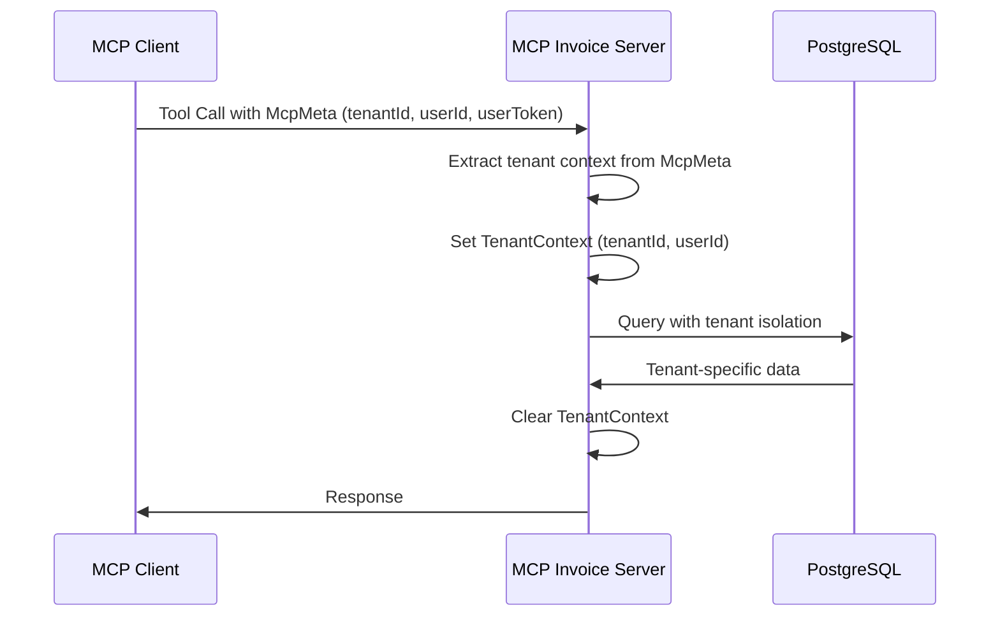
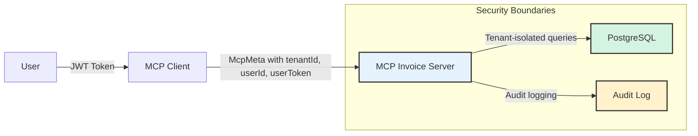

# MCP Invoice Processing Server

A multi-tenant invoice processing server built with Spring AI 1.1 Model Context Protocol (MCP) support, featuring secure user context propagation and comprehensive audit logging.

## 🎯 Project Overview

This MCP server demonstrates a production-ready approach to secure, multi-tenant AI tool integration following the latest MCP 1.1 specification and security best practices for centrally-hosted MCP clients.

### Key Features

- ✅ **Spring AI 1.1 MCP Compliance**: Built using Spring AI 1.1.0-M1 with proper MCP annotations
- ✅ **Multi-Tenant Security**: Secure user context propagation using `McpMeta` parameters
- ✅ **Process Isolation**: Separate MCP server process for security boundaries
- ✅ **JWT Token Delegation**: User tokens passed through MCP calls without elevated service credentials
- ✅ **Comprehensive Audit Logging**: Full MCP operation tracking
- ✅ **Docker Ready**: Complete containerization support

## 🏗️ Architecture

### Authentication & Multi-Tenancy Flow



### Security Architecture



## 🔧 MCP Tools

### Invoice Processing Tools

| Tool Name | Description | Parameters |
|-----------|-------------|------------|
| `process-invoice` | Create new invoices with validation | invoiceNumber, vendorName, totalAmount, etc. |
| `update-invoice` | Modify existing invoices | invoiceId, optional fields to update |
| `delete-invoice` | Remove invoices | invoiceId |
| `check-invoice-exists` | Duplicate detection | invoiceNumber |
| `search-invoices-by-vendor` | Query by vendor | vendorName, page, size |
| `get-invoice-statistics` | Analytics and stats | - |

### Audit & Monitoring Tools

| Tool Name | Description | Parameters |
|-----------|-------------|------------|
| `get-audit-logs` | Retrieve audit logs | page, size |
| `get-operation-statistics` | Performance metrics | - |

## 📊 MCP Resources

URI-based access to invoice data:

- `invoice://{invoiceId}` - Get specific invoice details
- `invoice-list://{status}` - List invoices by status (PENDING, APPROVED, etc.)
- `vendor-invoices://{vendorName}` - List invoices by vendor

## 🗄️ Database Schema

### Multi-Tenant Database Design

```
mcp_invoice schema:
├── tenants                 # Tenant management
├── invoices               # Main invoice data
├── invoice_line_items     # Invoice line items
└── mcp_audit_log         # MCP operation audit trail
```

### Key Tables

#### `invoices` Table
- Multi-tenant isolation via `tenant_id`
- Comprehensive invoice data (vendor, customer, amounts, dates)
- Processing status tracking
- Validation error storage (JSONB)
- Metadata support (JSONB)

#### `mcp_audit_log` Table
- Complete MCP operation tracking
- Tenant-isolated audit trails
- Performance metrics (execution time)
- Success/failure tracking

## 🚀 Getting Started

### Prerequisites

- Java 17+
- PostgreSQL 15+
- Docker (optional)

### Local Development

1. **Start PostgreSQL** (using Docker Compose from parent directory):
   ```bash
   cd ..
   docker-compose up postgres -d
   ```

2. **Build and Run**:
   ```bash
   ./mvnw clean spring-boot:run
   ```

3. **Access MCP Server**:
   - Server runs on port `8081`
   - MCP endpoint: `http://localhost:8081/mcp-invoice/mcp`
   - Health check: `http://localhost:8081/mcp-invoice/actuator/health`

### Docker Deployment

```bash
# From parent directory
docker-compose up mcp-invoice-server
```

## ⚙️ Configuration

### Application Properties

Key configuration options in `application.yml`:

```yaml
server:
  port: 8081
  servlet:
    context-path: /mcp-invoice

spring:
  ai:
    mcp:
      server:
        enabled: true
        name: invoice-processing-server
        annotation-scanner:
          enabled: true
        webmvc:
          enabled: true
          path: /mcp

# Multi-tenancy
multitenancy:
  enabled: true
  default-tenant: default
  tenant-header: X-Tenant-ID
  tenant-claim: tenant_id

# JWT Authentication
jwt:
  secret: ${JWT_SECRET:...}
  access-token-expiration: 3600000
```

### Environment Variables

| Variable | Description | Default |
|----------|-------------|---------|
| `DB_USERNAME` | Database username | `mcp_invoice_user` |
| `DB_PASSWORD` | Database password | `mcp_invoice_password` |
| `JWT_SECRET` | JWT signing secret | Auto-generated secure key |
| `CORS_ORIGINS` | Allowed CORS origins | `http://localhost:8080` |

## 🔒 Security Features

### Multi-Tenant Isolation

- **Database Level**: All queries filtered by `tenant_id`
- **Context Management**: Thread-local tenant context
- **Automatic Cleanup**: Context cleared after each request

### JWT Token Delegation

- User tokens passed via `McpMeta` parameter
- No elevated service credentials
- Token validation and user extraction
- Secure token propagation to downstream services

### Audit Trail

- Complete MCP operation logging
- Tenant-isolated audit logs
- Performance metrics tracking
- Success/failure analysis

## 🧪 Testing

### Unit Tests

```bash
./mvnw test
```

### Integration Tests

```bash
./mvnw integration-test
```

### MCP Tool Testing

Use MCP client tools to test individual operations:

```bash
# Example: Check if invoice exists
curl -X POST http://localhost:8081/mcp-invoice/mcp/tools/call \
  -H "Content-Type: application/json" \
  -d '{
    "name": "check-invoice-exists",
    "arguments": {
      "invoiceNumber": "INV-001"
    },
    "_meta": {
      "tenantId": "default",
      "userId": "user123",
      "userToken": "jwt-token-here"
    }
  }'
```

## 📈 Monitoring & Observability

### Health Checks

- Spring Boot Actuator endpoints
- Custom MCP health indicators
- Database connectivity checks

### Metrics

- MCP operation performance
- Tenant-specific usage statistics
- Error rate monitoring

### Logging

- Structured JSON logging
- Tenant context in all log entries
- Audit trail correlation

## 🔄 Integration with Main Application

### MCP Client Configuration

In your main LLM-OCR application, configure the MCP client:

```yaml
spring:
  ai:
    mcp:
      client:
        enabled: true
        connections:
          invoice-server:
            url: "http://localhost:8081/mcp-invoice/mcp"
            transport: HTTP
```

### User Context Propagation

Ensure user context is passed in MCP calls:

```java
// In your ChatbotController
McpMeta userMeta = McpMeta.builder()
    .put("tenantId", extractTenantId(httpRequest))
    .put("userId", extractUserId(httpRequest))
    .put("userToken", extractJwtToken(httpRequest))
    .build();

// Pass meta with tool calls
chatClient.prompt()
    .user(request.getMessage())
    .toolContext(Map.of("mcpMeta", userMeta))
    .call()
    .content();
```

## 🚀 Deployment

### Production Checklist

- [ ] Configure production database
- [ ] Set secure JWT secrets
- [ ] Configure CORS origins
- [ ] Set up monitoring
- [ ] Configure log aggregation
- [ ] Set up backup procedures

### Scaling Considerations

- **Horizontal Scaling**: Stateless design supports multiple instances
- **Database**: Use connection pooling and read replicas
- **Caching**: Consider Redis for frequently accessed data
- **Load Balancing**: Standard HTTP load balancing works

## 📚 API Documentation

### MCP Tools Schema

The server automatically generates JSON schema for all MCP tools. Access via:
- Tool discovery: `GET /mcp-invoice/mcp/tools/list`
- Tool schema: `GET /mcp-invoice/mcp/tools/{toolName}/schema`

### Resource URIs

- `invoice://{invoiceId}` - Individual invoice access
- `invoice-list://{status}` - Status-based invoice lists
- `vendor-invoices://{vendorName}` - Vendor-specific invoices

## 🤝 Contributing

1. Fork the repository
2. Create feature branch
3. Add tests for new functionality
4. Ensure all tests pass
5. Submit pull request

## 📄 License

This project is part of the LLM-OCR system and follows the same licensing terms.

## 🔗 Related Documentation

- [Spring AI MCP Documentation](https://docs.spring.io/spring-ai/reference/1.1/api/mcp/mcp-annotations-server.html)
- [Model Context Protocol Specification](https://modelcontextprotocol.io/)
- [Multi-Tenant MCP Security Analysis](../kt-docs/newmcp/centrally_hosted_mcp_client_security.md)
- [MCP Security Best Practices](../kt-docs/newmcp/better_security_with_new_mcp_spec.md)
